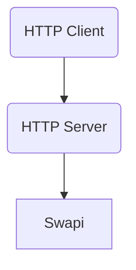
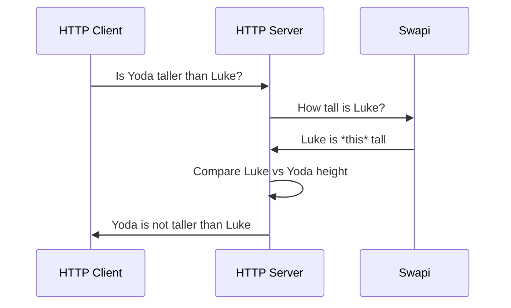
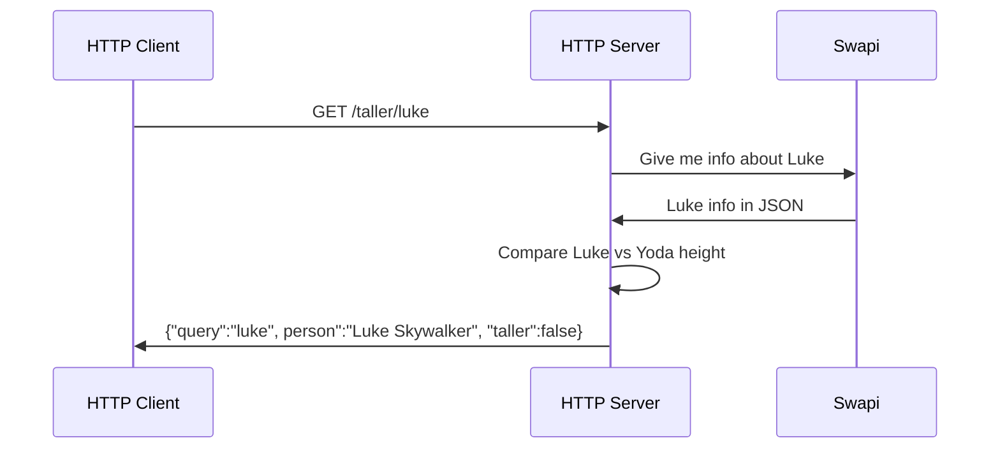

# Rust API workshop

Write an HTTP API in Rust through a series of test-driven exercises.

## What will you build?

A simple HTTP API that checks if Yoda is taller than a given Star Wars character.

For example, if we want to check if Yoda is taller than Luke Skywalker,
we can do this GET request with `curl`:

```sh
$ curl 127.0.0.1:3000/taller/luke
{
  "query": "luke",
  "person": "Luke Skywalker",
  "taller": false
}
```

## Architecture

This is the architecture of our system:



- HTTP Client: the software you can use to interact with your API. It can be anything: curl, [Insomnia](https://github.com/Kong/insomnia), and so on.
- HTTP Server:  the component you will implement.
- [Swapi](https://swapi.dev/): the service you are going to use to retrieve
  info about the Star Wars characters.

## Sequence diagram

This is the flow of the system:



Let's translate some high-level details from the previous diagram:



## Setup

```sh
mkdir workshop
cd workshop
# Clone this fork of swapi (it contains an additional person)
git clone https://github.com/MarcoIeni/swapi
# Clone this repo
git clone https://github.com/MarcoIeni/rust-api-workshop
cd rust-api-workshop
# Create your branch
git checkout -b workshop
# Run the tests to make sure your rust installation works
cargo test
```

## Get started

Open the `rust-api-workshop` project in your favorite editor.
By looking at the main [`Cargo.toml`](./Cargo.toml), you can see there are two crates:
- [`workshop`](./src/workshop): the crate you will use to implement the HTTP API.
- [`yoda-taller`](./src/yoda-taller): the crate that contains a possible implementation of the HTTP API.
  Please, don't look inside this folder before trying to solve the exercises by yourself, first.

To start the workshop, jump on the file [`src/workshop/tests/api/main.rs`](src/workshop/tests/api/main.rs).

## Credits

Some pieces of code, names or conventions are inspired by:
- [zero-to-production](https://github.com/LukeMathWalker/zero-to-production)
- [build-your-own-jira-with-rust](https://github.com/LukeMathWalker/build-your-own-jira-with-rust)
