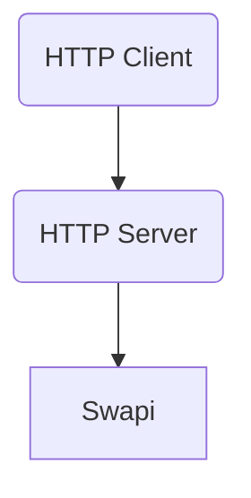
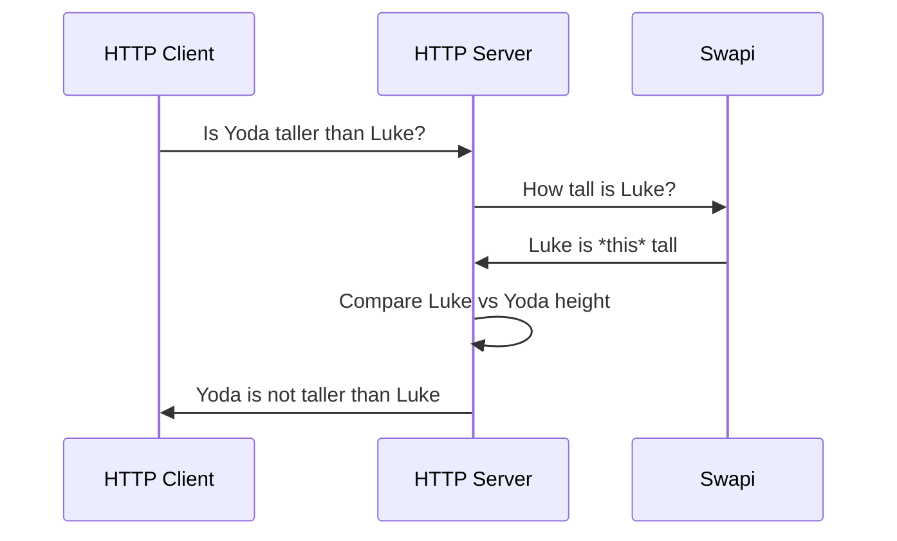
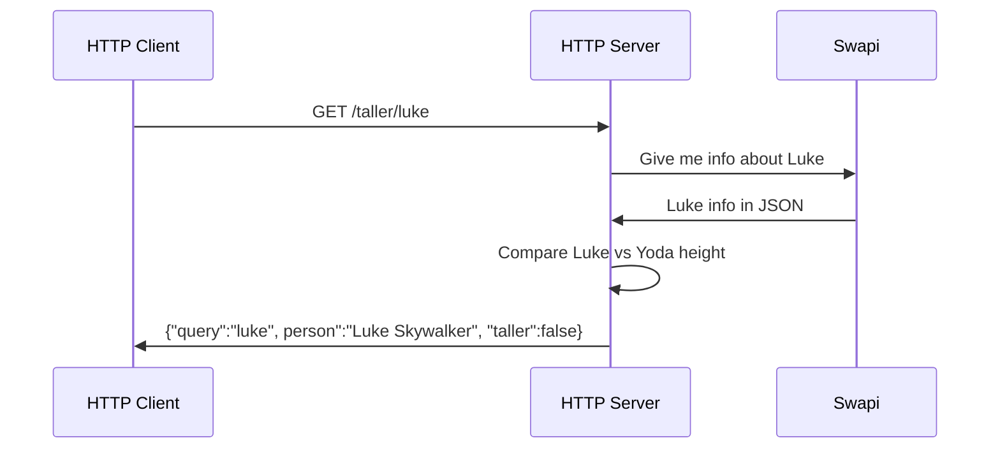

# rust-api-workshop
Write a production-ready Rust HTTP API

Some pieces of code, names or conventions are inspired by [zero-to-production](https://github.com/LukeMathWalker/zero-to-production).

## What will you build?

A simple HTTP API that checks if Yoda is taller than a given Star Wars character.

For example, if we want to check if Yoda is taller than Luke Skywalker,
we can do this GET request with `curl`:

```sh
$ curl 127.0.0.1:3000/taller/luke
{
  "query": "luke",
  "person": "Luke Skywalker",
  "taller": false
}
```

## Architecture

This is the architecture of our system:



- The HTTP Client can be anything: curl, [Insomnia](https://github.com/Kong/insomnia), and so on. It's the software you can use to interact with your API.
- The HTTP Server it's the component you will implement.
- [Swapi](https://swapi.dev/) is the service you are going to use to retrieve
  info about the Star Wars characters.

## Sequence diagram

This is the flow of the system:



Let's translate some high-level details from the previous diagram:



## Get started

```sh
mkdir workshop
cd workshop
# Clone this fork of swapi (it contains an additional person)
git clone https://github.com/MarcoIeni/swapi
# Clone this repo
git clone https://github.com/MarcoIeni/rust-api-workshop
cd rust-api-workshop
# Create your branch
git checkout -b workshop
```
